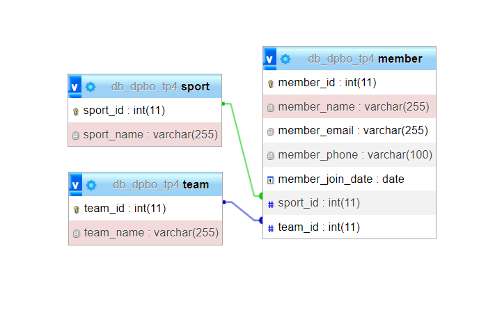
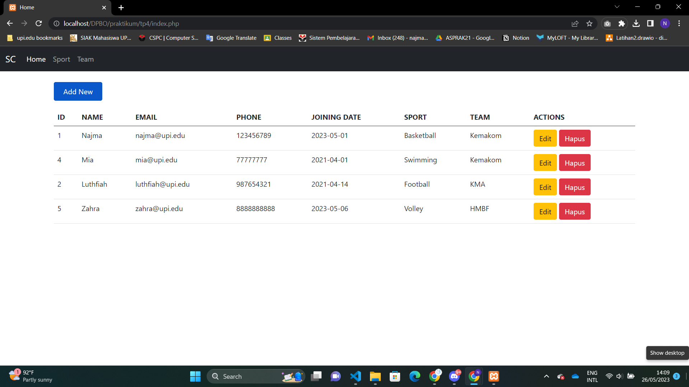

# TP4DPBO2023C1
Tugas Praktikum 4 Mata Kuliah Desain dan Pemrograman Berorientasi Objek. Program CRUD sederhana dengan PHP GUI yang mengimplementasikan MVC.

Saya Najma Qalbi Dwiharani dengan NIM 2102843 mengerjakan soal TP 4 dalam mata kuliah Desain dan Pemrograman Berorientasi Objek untuk keberkahanNya maka saya tidak melakukan kecurangan seperti yang telah dispesifikasikan. Aamiin.

## Desain

  

## Alur Program

Program ini merupakan program CRUD sederhana dengan tema Sport Club universitas, dimana member club memiliki beberapa detail data. Tiap member dapat memilih sport/olahraga yang diminati dan memilih asal team dari daftar team yang ada.

Pada program ini terdapat empat halaman/page:

### 1. Halaman Utama

- Berisi daftar member beserta detailnya dalam bentuk tabel
- Dapat menghapus data member dengan tombol hapus pada kolom actions
- Dapat mengupdate data member dengan tombol edit pada kolom actions dan akan berpindah ke halaman form untuk mengupdate

### 2. Halaman Form Add/Update Member

- Form untuk menambah/mengupdate member baru
- Jika digunakan untuk update maka akan field input akan berisi data lama yang telah tersimpan

### 3. Halaman Sport

- Berisi daftar sport dan form untuk menambah sport baru
- Dapat menghapus dan mengupdate sport dengan tombol pada kolom actions
- Jika form digunakan untuk update maka akan menampilkan data nama sport yang telah tersimpan sebelumnya

### 4. Halaman Team

- Berisi daftar team dan form untuk menambah team baru
- Dapat menghapus dan mengupdate team dengan tombol pada kolom actions
- Jika form digunakan untuk update maka akan menampilkan data nama team yang telah tersimpan sebelumnya

## Dokumentasi

  